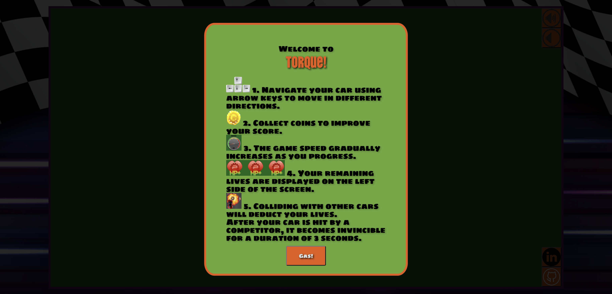
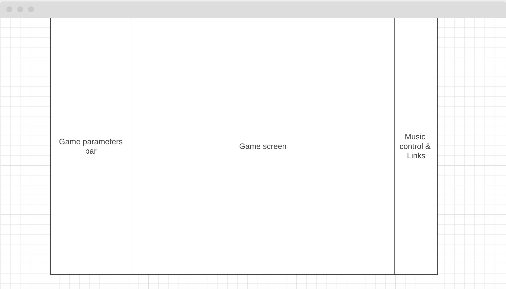

# Torque

[Torque](https://antonjames-sistence.github.io/Torque/) is an exhilarating racing game inspired by the fast-paced 80s arcade classics. As soon as the game loads, players are greeted with clear instructions to guide them through the game. Once they press the gas button, the thrilling race begins, immersing them in an adrenaline-fueled experience.

## Wireframe:

* The main game screen features a dynamic canvas that constantly updates its graphics based on the player's input and the game's logic, delivering an immersive gaming experience.
* The game parameters bar provides vital information such as hit points, score, and game speed, giving players real-time feedback on their progress and performance.
* Located on the right side of the screen, the navigation bar includes a music control bar to manage the in-game audio, as well as convenient links to my LinkedIn profile and the GitHub repository for this project.

## Functionality:

### Car navigation:

* Players can skillfully navigate their cars by utilizing the arrow keys on their keyboard, allowing for precise control and maneuverability within the game world. 
<!-- navigation img -->
<!-- code img -->

### Dodge Other Cars:

* Stay alert and skillfully avoid colliding with other cars to survive longer and achieve a higher final score. Find gaps and opportunities to safely pass other vehicles.
<!-- dodging img -->
<!-- code img -->

### Collect Coins:

* Gather coins scattered throughout the game world to improve your score, adding an extra layer of challenge and reward to gameplay.
<!-- collecting img -->
<!-- code img -->

### Music:

* Enjoy a carefully selected soundtrack that enhances the atmosphere and adds excitement to your gameplay.

### Score:

*  Keep track of your performance and strive for a high score. Monitor your progress and aim to surpass your previous achievements, adding a competitive element to the game and encouraging replayability.
<!-- score img -->
<!-- code img -->

## Technologies

* The Canvas API is utilized to render the game and dynamically update its parameters, delivering a visually engaging and interactive experience. By leveraging the power of the Canvas API, the game graphics are efficiently rendered on the screen, allowing animations and responsive gameplay. Additionally, the API enables game parameters such as player scores, health, and other crucial gameplay elements, ensuring that the game remains engaging and challenging throughout the gaming session.
* Webpack is employed to bundle and transpile the source JavaScript code, optimizing the development workflow and enhancing the compatibility and performance of the web application. By leveraging Webpack's capabilities, the source code is efficiently bundled into a single file, reducing network requests and improving load times. Moreover, Webpack's transpilation feature ensures that the JavaScript code is transformed to a compatible version, enabling cross-browser support and taking advantage of the latest language features.
* npm (Node Package Manager) to manage project dependencies.

## Future Implementations:

* Enhanced car sprites.
* Car Animations: Implement dynamic animations for the cars, such as smooth acceleration, braking, and turning movements, to create a more immersive and engaging gameplay experience.
* Expanded Collectible Items: Introduce a wider variety of items for players to collect during the game, providing additional challenges, rewards, and power-ups to enhance gameplay dynamics.
* Pause Functionality: Implement a pause feature that allows players to temporarily halt the game, providing flexibility and convenience without losing progress. This feature will enable players to take breaks or attend to other tasks while retaining their current game state.
* Crash sound effects, effects for collecting items. These sound effects will heighten the intensity of the gameplay and provide auditory feedback and adding an extra layer of realism and excitement.

<!-- ## CC Licensing: -->